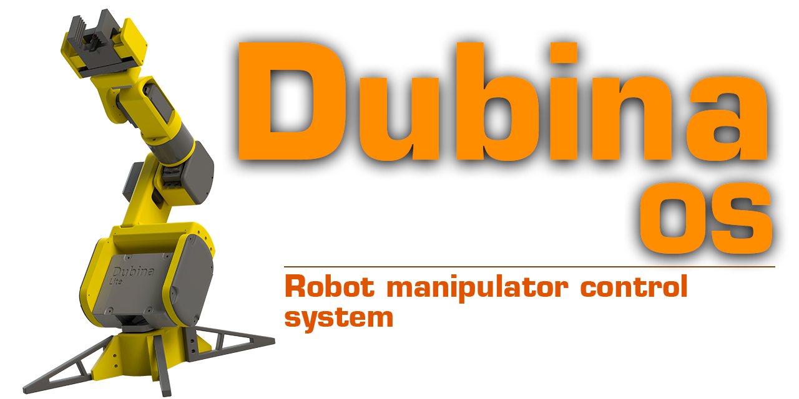

<p align="center">
  <a href="https://github.com/AndrewPst/Manipulator_6dof_gcode_os">
    
  </a>

  <h1 align="center">Dubina OS</h1>

  <div align="center">
    OS for a 6-axis robot manipulator with support for GCODE commands
    <br/>
    <br/>
    <a href="https://youtu.be/zWKjZ1wgmps">View Demo</a>
    .
    <a href="https://github.com/AndrewPst/Manipulator_6dof_gcode_os">Report Bug</a>
    .
    <a href="https://github.com/AndrewPst/Manipulator_6dof_gcode_os">Request Feature</a>
  </div>
</p>


<div align="center">
  
   

</div>

## Table Of Contents

* [About the Project](#about-the-project)
* [Built With](#built-with)
* [Getting Started](#getting-started)
  * [Prerequisites](#prerequisites)
  * [Installation](#installation)
  * [Setup](#setup)
* [Usage](#usage)
* [Contributing](#contributing)
* [License](#license)
* [Authors](#authors)

## About The Project

**Dubina OS** is an operating system for controlling a robot manipulator with 6 degrees of freedom. The system core is responsible for executing _GCODE_ format commands. The drivers of the drives are responsible for the implementation of the movement. Any user interaction with the kernel is carried out only through sending _GCODE_ commands. The forward and reverse kinematics algorithm are components of the OS. They adapt to the size of the robot specified in the configuration file.

Features:
- Support for GCODE commands;
- Launching executable files from the SD card;
- Forward and reverse kinematics algorithms;
- Support for different types of drives;
- Support for peripherals (display, buttons, sound, light indicators, etc.) if there is a driver;

## Built With

* [PlatfotmIO](https://platformio.org/)
* [Mbed OS](https://github.com/ARMmbed/mbed-os)
* [VS Code](https://code.visualstudio.com/)

## Getting Started

### Prerequisites

1. [Download](https://github.com/AndrewPst/Manipulator_6dof_gcode_os) latest actual version of Dubina OS. Make sure that the platform matches yours.
2. [Download](https://www.st.com/en/development-tools/stsw-stm32102.html#get-software) and install the virtual COM port driver for stm32.
3. [Download](https://www.st.com/en/development-tools/stsw-link004.html) and install "ST-Link Utility"

### Installation

1. Connect the stm32 to the computer;
2. Run the "ST-Link Utility" program;
3. Connect to the controller by clicking on the "Connect to the target" button;
4. Click on the "Open file" button and select the binary file with the firmware;
5. Click on the "Program verify" and "start" buttons;

### Setup

You can configure the project yourself and build it for your platform.

---

Configure the debugger connection contacts, buttons, and debug level in the ```config.h``` file:

```c++
//Debug params
constexpr const int DEBUG_SERIAL_BOUD = 9600;

//Debug serial pins
constexpr const PinName DEBUG_PORT_TX = USBTX;
constexpr const PinName DEBUG_PORT_RX = USBRX;
//buttons pins
constexpr const PinName STOP_BUTTON_PIN = PB_2;
constexpr const PinName REINIT_BUTTON_PIN = PB_12;

//Path to config file(currently not supported)
constexpr static const char* CONFIG_FILE_PATH = "/sd/config.json";

#define __USE_SDCARD 1

//Mount sd card at startup
#define __AUTO_SD_INIT 0

//Output additional information to the executed command
#define __PRINT_PARSED_INPUT 0

#define __DEBUG_LEVEL_NONE 0
#define __DEBUG_LEVEL_INFO 1
#define __DEBUG_LEVEL_ERRORS 2
#define __DEBUG_LEVEL_VERBOSE 3
```
---

Enter the denavit-hartenberg parameters in the file ```main.cpp``` . This will allow you to correctly calculate the inverse kinematics for your robot

```c++
core::ExecutionEnivroment env{
    .manipulator = Manipulator{
        .dhTable = {
            .theta = {0, degToRad(-90), 0, 0, 0, 0},
            .alfa = {degToRad(-90), 0, degToRad(-90), degToRad(90), degToRad(-90), 0},
            .d = {83.5, 0, 0, 105, 0, 100},
            .r = {0, 133, 10, 0, 0, 0},
        },
    },
};
```
---
Register the drives of your robot by choosing the appropriate driver and connection contact. Pay attention to the transmitted parameters, such as a table of reference values for servos. It is needed for more precise positioning of the joints. File - ```core/core.h```

```c++
        template <typename _actRegT>
        uint8_t readConfigFile(_actRegT &actRegistrator, ExecutionContext &context)
        {
            context.enivroment().manipulator.joints.push_back(std::unique_ptr<ServoJoint>(new ServoJoint({&(actRegistrator.template registerActuator<ServoDriver>(D2))})));

            ServoDriver *servo = &(actRegistrator.template registerActuator<ServoDriver>(D3, _table1));
            servo->setInverse(true);
            context.enivroment().manipulator.joints.push_back(std::unique_ptr<ServoJoint>(new ServoJoint({servo, &(actRegistrator.template registerActuator<ServoDriver>(D4))})));

            servo = &(actRegistrator.template registerActuator<ServoDriver>(D5, _table3));
            servo->setMax(155);
            context.enivroment().manipulator.joints.push_back(std::unique_ptr<ServoJoint>(new ServoJoint({servo})));

            context.enivroment().manipulator.joints.push_back(std::unique_ptr<ServoJoint>(new ServoJoint({&(actRegistrator.template registerActuator<ServoDriver>(D6))})));

            servo = &(actRegistrator.template registerActuator<ServoDriver>(D7, _table4));
            servo->setInverse(true);
            context.enivroment().manipulator.joints.push_back(std::unique_ptr<ServoJoint>(new ServoJoint({servo})));

            context.enivroment().manipulator.joints.push_back(std::unique_ptr<ServoJoint>(new ServoJoint({&(actRegistrator.template registerActuator<ServoDriver>(D8))})));

            servo = &(actRegistrator.template registerActuator<ServoDriver>(PC_8));
            context.enivroment().manipulator.effector = std::unique_ptr<ServoGripper>(new ServoGripper(*servo));

            return 0;
        }
```

## Usage

After turning on the robot, connect it to the computer. Use any program to communicate with the robot via a serial interface ([Termite](https://termite.software.informer.com/3.2/) is recommended). Send commands in GCODE format.


<details>

<summary>Supported commands</summary>

| Command key | Arguments | Description |
| :---:         | ---       | ---         |
| G0 | (X Y Z A B G) - position and orientation; T - time in ms; P - effector value | Moving to a point without linear movement |
| G1 | (X Y Z A B G) - position and orientation; F - speed in mm/s; P - effector value | linear movement |
| G4 | P - time in ms OR S - time in seconds | pause |
| G5 | (A B C D E F) - index of joint; S - speed in degrees/second; P - effector value | independent rotation of joints with one speed |
| G6 | (A B C D E F) - index of joint; T - time in ms; P - effector value | independent rotation of joints in one time |
| M17 | - | enable actuators |
| M18 | - | disable actuators |
| M20 | - | display a list of files on the sd card |
| M21 | - | mount SD card |
| M22 | - | unmount actuators |
| M21 | - | mount SD card |
| M23 | /sd/filename.gcode | select file from SD card |
| M24 | -| start or resume execution |
| M25 | -| pause execution |
| M32 | /sd/filename.gcode | select file from SD card and start execution |
|M112| - |emergency stop|

</details>
Exemples:

```gcode
G5 A16 B32 C-21.23 F0 P13 T5000
M18
M17
M32 /sd/program.gcode
M112
```

Or use [DRK](https://github.com/AndrewPst/Manipulator_6Dof_DUBINA_Lite#usage).

## Contributing

* If you have suggestions for adding or removing projects, feel free to [open an issue](https://github.com/AndrewPst/Manipulator_6dof_gcode_os/issues/new) to discuss it, or directly create a pull request after you edit the *README.md* file with necessary changes.
* Please make sure you check your spelling and grammar.
* Create individual PR for each suggestion.

### Creating A Pull Request

1. Fork the Project
2. Create your Feature Branch (`git checkout -b feature/AmazingFeature`)
3. Commit your Changes (`git commit -m 'Add some AmazingFeature'`)
4. Push to the Branch (`git push origin feature/AmazingFeature`)
5. Open a Pull Request

## License

Distributed under the MIT License. See [LICENSE](/LICENSE) for more information.

## Authors

* **Andrew Pustovit** - *Comp Sci Student* - [AndrewPst](https://github.com/AndrewPst) - *Dubina OS developer*
